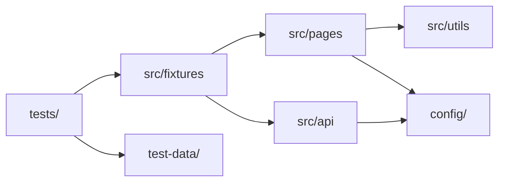
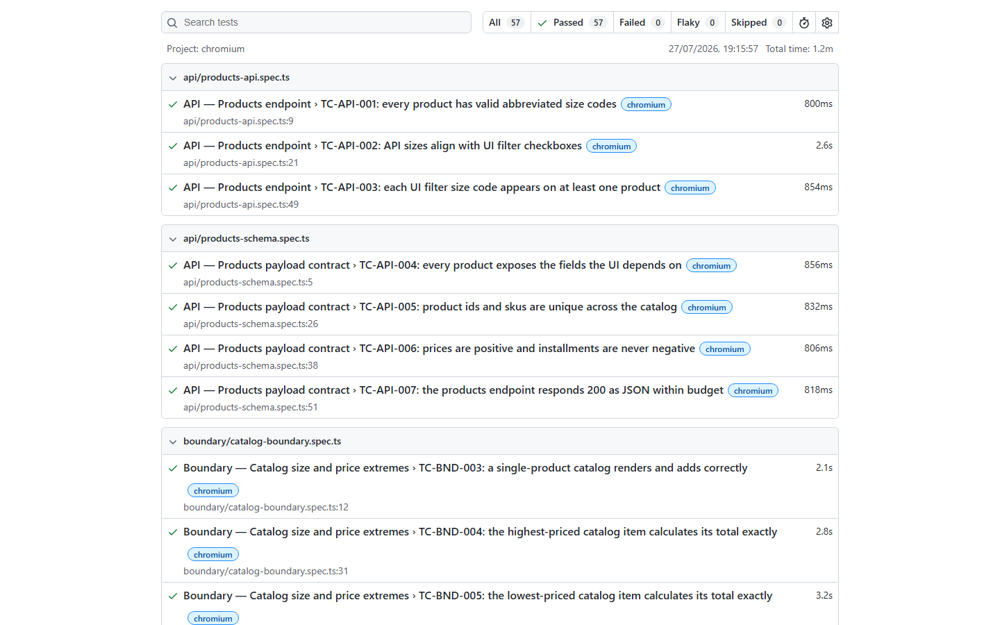
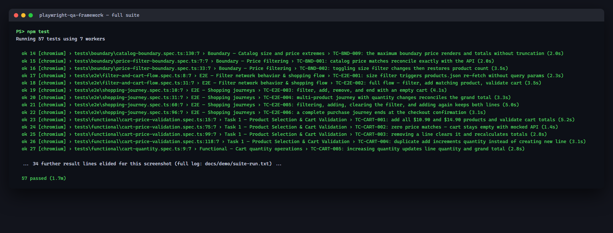

# Playwright QA Framework — React Shopping Cart

[](https://github.com/SatyamChouksey-88/playwright-qa-framework/actions/workflows/playwright.yml)
[](https://playwright.dev)
[](LICENSE)

**[▶ Live test report](https://satyamchouksey-88.github.io/playwright-qa-framework/)**

Playwright + TypeScript automation for the public
[React Shopping Cart](https://react-shopping-cart-67954.firebaseapp.com/products)
demo. Built as an SDET portfolio framework: Page Object Model, fixtures,
multi-env config, API checks, and CI that publishes an HTML report.

## 1. Overview

The app under test is a public SPA (not in this repo). This suite proves a
maintainable UI + API automation layout: semantic locators where the DOM
allows, fixtures instead of copy-pasted `beforeEach` setup, and pipelines on
GitHub Actions, Azure DevOps, and Jenkins.

**57 tests** · Chromium / Firefox / WebKit · three application defects documented
in [docs/defects.md](docs/defects.md).

## 2. Test coverage

| Area | Tests | Type |
|---|---|---|
| Functional | 17 | Catalog, cart quantity, size filter, price validation |
| Negative | 14 | Empty/error catalog, cart edge cases |
| Boundary | 9 | Catalog + price-filter edges |
| End-to-end | 6 | Filter → cart journeys |
| API | 7 | `products.json` contract + schema |
| Performance | 4 | Large catalog render smoke |

Total: **57** · Browsers: Chromium, Firefox, WebKit · CI: 2 shards + report merge

## 3. Tech stack

Playwright · TypeScript · POM + fixtures · ESLint (`eslint-plugin-playwright`) ·
Prettier · GitHub Actions · Azure Pipelines · Jenkins · HTML report on Pages

## 4. Architecture



Short version: specs orchestrate; fixtures inject page objects and the API
client; page objects own locators and user actions; config selects
dev/staging/prod. Details: [docs/architecture.md](docs/architecture.md).

## 5. Design decisions

See **[docs/DESIGN_DECISIONS.md](docs/DESIGN_DECISIONS.md)** for why fixtures
beat `beforeEach`, how locators are chosen, how flakiness is handled, and what
was intentionally left out of automation.

## 6. Getting started

```bash
npm ci
npx playwright install --with-deps
npx playwright test
```

Smoke / subset examples:

```bash
npx playwright test tests/e2e
npx playwright test --project=chromium
cross-env TEST_ENV=prod npx playwright test tests/api
```

Copy `.env.example` → `.env` if you need to override `TEST_ENV` or URLs.

| Command | Description |
|---|---|
| `npm test` | Full suite (all projects) |
| `npm run test:e2e` / `:api` / `:functional` / … | Category folders |
| `npm run test:dev` / `:staging` / `:prod` | Environment switch |
| `npm run validate` | Typecheck + ESLint + encoding gate |
| `npm run test:report` | Open last HTML report |

## 7. CI/CD

| Trigger | What runs |
|---|---|
| Push to `main`, pull requests | Lint → sharded Playwright (3 browsers) → merge HTML report |
| Nightly cron (`02:00 UTC`) | Same suite against the live public demo |
| `workflow_dispatch` | Manual run with env choice |

- Workflow: [`.github/workflows/playwright.yml`](.github/workflows/playwright.yml)
- Sharding: 2 shards emit blob reports → `playwright merge-reports` → one HTML
- Pages: `actions/upload-pages-artifact` + `actions/deploy-pages` from `main`
- Also: [`azure-pipelines.yml`](azure-pipelines.yml), [`Jenkinsfile`](Jenkinsfile)

## 8. Reports & evidence

| Evidence | Location |
|---|---|
| Live HTML report | https://satyamchouksey-88.github.io/playwright-qa-framework/ |
| Annotated screenshots | [docs/demo/](docs/demo/) |
| Failure walkthrough | [docs/failure-analysis-example.md](docs/failure-analysis-example.md) |





## 9. Roadmap / known limitations

- Public demo host can change or go offline — quarantine or `page.route` mocks
  are the intended mitigation (do not leave a red badge unexplained).
- No real checkout/payment path on the demo app.
- Firefox/WebKit increase CI wall time; sharding keeps PRs workable.
- Visual regression (`toHaveScreenshot`) not in scope yet.

## 10. Author & license

**Satyam Chouksey** — QA Automation Engineer / SDET · Bhopal, India  
GitHub: [SatyamChouksey-88](https://github.com/SatyamChouksey-88)

MIT — see [LICENSE](LICENSE).
