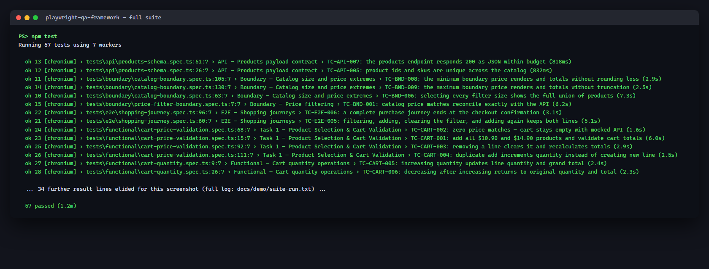
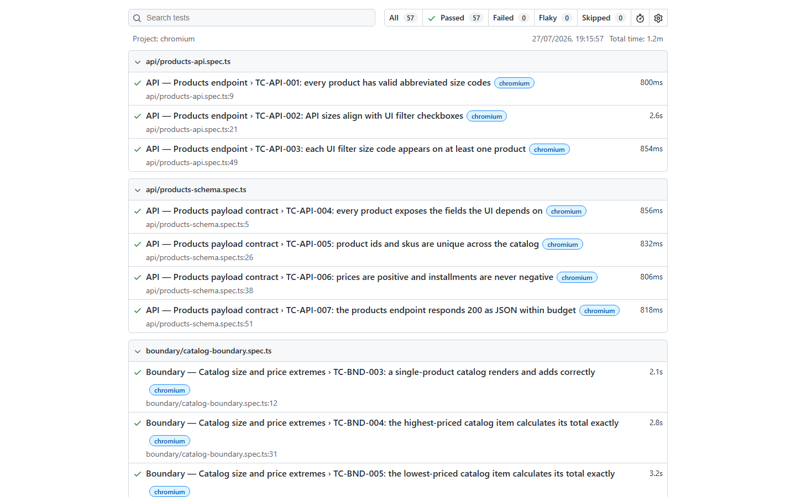
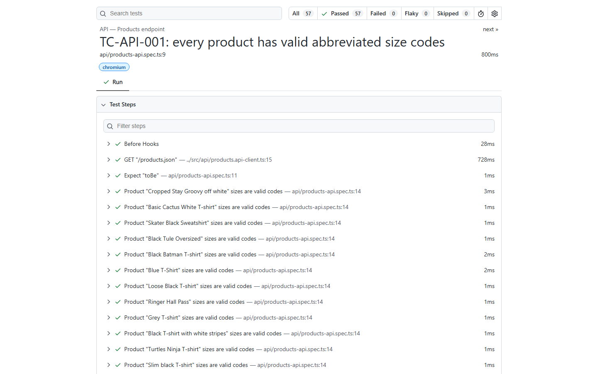
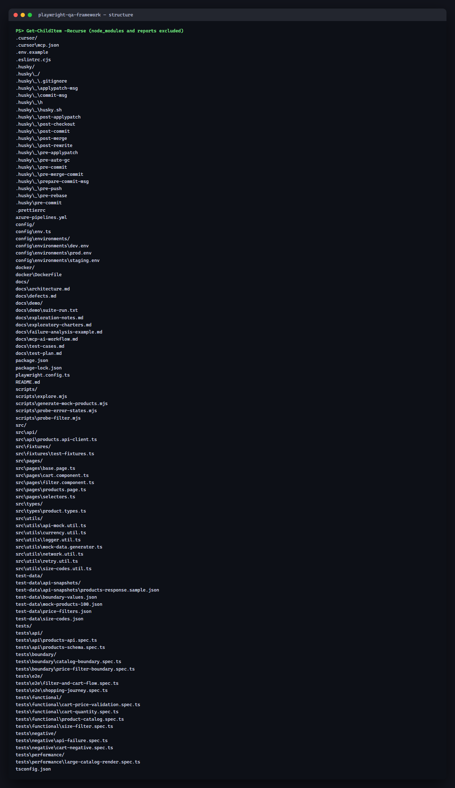

# Demo Walkthrough

**Captured:** 2026-07-27 · **Result:** 57 passed, 0 failed, 0 flaky

An annotated script for presenting the framework, with the artifacts each step
produces. Screen recording was not possible in this environment, so each step
links to a captured still.

Regenerate every image with:

```bash
npm test                                                   # produces playwright-report/
npx playwright show-report --host 127.0.0.1 --port 9323     # terminal 1
node scripts/capture-demo.mjs                               # terminal 2
```

> **Provenance.** `02-html-report-overview.png` and
> `03-html-report-test-detail.png` are true browser screenshots of the live HTML
> report. `01-suite-run.png` and `04-folder-structure.png` render the verbatim
> captured stdout from `suite-run.txt` and `folder-structure.txt` into a terminal
> style page — the text is unmodified, only the presentation is synthesised,
> because a headless agent cannot photograph a terminal window.

---

## Step 1 — Run the suite

> "The whole suite is one command. 57 tests across six categories, all against
> the live application, finishing in about a minute on four workers."

```bash
npm test
```



Talk through:

- **57 passed** — the count in the summary line matches `npx playwright test --list`.
- Per-test timings are visible, so a slow test is obvious immediately.
- Test IDs (`TC-CART-001`, `TC-BND-009`, …) map 1:1 to rows in
  [`../test-cases.md`](../test-cases.md), so every run is traceable to the plan.

Scoped runs for a focused demo:

```bash
npm run test:functional     # 17 tests
npm run test:negative       # 14 tests
npm run test:boundary       #  9 tests
npm run test:e2e            #  6 tests
npm run test:api            #  7 tests
npm run test:performance    #  4 tests
```

Full log: [`suite-run.txt`](./suite-run.txt)

## Step 2 — Open the HTML report

> "Reporting is the Playwright HTML report, generated on every local run and
> published as a CI artifact."

```bash
npm run test:report
```



Talk through:

- Header counts: **All 57 · Passed 57 · Failed 0 · Flaky 0 · Skipped 0**.
- Tests group by spec file, which mirrors the `tests/<category>/` layout.
- `playwright-report/` is git-ignored (`.gitignore:5`) — the report is an
  artifact, never a committed file.

## Step 3 — Drill into a single test

> "Every test records its steps, so a failure points at a line, not a screenshot."



Talk through:

- `test.step()` calls produce the named rows — for example
  `Product "Cropped Stay Groovy off white" sizes are valid codes`, each linked to
  `api/products-api.spec.ts:14`.
- The `GET "/products.json"` row comes from the API client, so request timing is
  visible inside the test.
- On failure this same view carries the trace, video, screenshot and an ARIA page
  snapshot. That is exactly how the six first-run failures in this round were
  diagnosed — see [`../mcp-ai-workflow.md`](../mcp-ai-workflow.md).

## Step 4 — Walk the structure

> "Strict layering: tests hold no selectors, pages hold no assertions about data,
> and every literal lives in test-data."



| Path | Role |
|------|------|
| `tests/<category>/` | Specs only — orchestration and assertions |
| `src/pages/` | Page and component objects |
| `src/pages/selectors.ts` | Every selector shared by 2+ page objects |
| `src/fixtures/` | Dependency injection for specs |
| `src/api/` | Typed REST client |
| `src/utils/` | Currency, network, mocking, size-code helpers |
| `config/` | Environment resolution + per-env `.env` files |
| `test-data/` | Externalised JSON — prices, boundaries, 100-product mock |
| `docs/` | Plan, cases, architecture, defects, MCP workflow, this demo |
| `.github/`, `azure-pipelines.yml`, `docker/` | CI/CD and containerisation |

Full listing: [`folder-structure.txt`](./folder-structure.txt)

## Step 5 — Show multi-environment execution

> "The same suite runs against a locally built app. 17 tests skip themselves with
> a stated reason, because a dev build cannot satisfy them."

```bash
cd ../react-shopping-cart && npm start   # terminal 1
npm run test:dev                         # terminal 2
```

```console
  17 skipped
  40 passed (55.3s)
```

Talk through: the app's `getProducts()` branches on `NODE_ENV` — a production
build calls Firebase, a dev build does `require('static/json/products.json')` and
issues no request. Mock-based and network-assertion tests therefore skip with an
explicit message rather than failing misleadingly. See
[`../architecture.md`](../architecture.md#environment-status).

## Step 6 — Show the defects found

> "The point of the suite is finding things. Three application defects came out
> of this cycle, each with reproduction evidence."

```bash
node scripts/probe-error-states.mjs
node scripts/probe-filter.mjs
```

Walk [`../defects.md`](../defects.md): DEF-001 (unhandled rejection on a failed
fetch), DEF-002 (malformed JSON leaves no terminal state), DEF-003 (rapid filter
toggles discard selections). DEF-001 and DEF-002 are pinned by TC-NEG-011 and
TC-NEG-012; DEF-003 is handled in the page object so it cannot leak into
flakiness.
